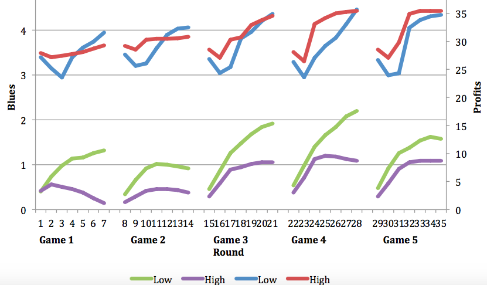
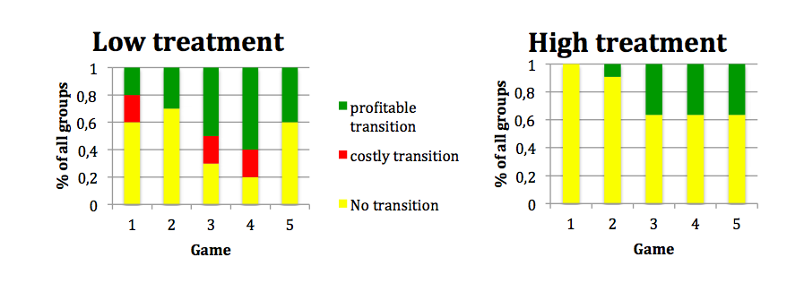

% Master thesis
% Tim Schrama
% TiSEM, Tilburg University

Introduction
================

Why?
----------
- Environment

- Gerlagh and Van der Heijden (2015)
 
- five-player game and different incentives

Game
====

General information
--------------------------

- Seven round, five games

- Blue and purple chips

- Different payoff schemes

Rules
---------
1. Changing 1 chip per round

2. No negative numbers allowed

3. No communication

Method
======

Outcomes
--------------------

- Nash Equilibrium

- Mixed Strategy Equilibrium

Infinite horizon
------------------

\begin{equation}
\pi_i ({b}(t)) = E[v_i(b(t+1)) - \bar{v} + \pi_i(b(t)+1)|b(t)] 
\end{equation}

Experiment
============

Design
-----------
- Treatments

- Participants

General results
============

Blues and Profits
---------

Transitions
--------

Hypothesis testing
================

Hypothesis 1
----------------
 A. There will be more participants switching to blue in the first round of the first game in the high treatment. 

 B. There will be more transitions in the high treatment.

 C. the payoffs will be higher in the high treatment.

 D. The individual payoffs of a participant relative to the maximum payoff will be the same in both treatments.

Hypothesis 2
------------------
 A. The number of participants switching to blue in the first round of a game is equal to the expected alpha in the infinite horizon for both treatments. 

 B. The average number of transitions is equal to the expected transitions in the infinite horizon game in both treatments.

 C. The individual payoff of a participant in each treatment is equal to the expected payoff in the infinite horizon game.

Hypothesis 3
------------------
 A. The individual payoff of a participant in the low treatment is equal to the payoff of a participant in the three-player game.

 B. The level of cooperation in the first round of the first game in the high treatment is comparable to the level of cooperation in the three-player game.

Hypothesis 4
-------------------
 A. The score of the cognitive thinking test is uncorrelated with the willingness to cooperate in the first round of the first game.

 B. The level of education and school are uncorrelated with the willingness to cooperate in the first round of the first game.

Conclusion
=============

Conclusion
---------------

- Both treatments could be used as baseline

- Treatments were unbalanced

- More transitions with low bonus

Recommendations
-----------------------
- Look at effects when treatments are balanced

- Look at effects of framing
